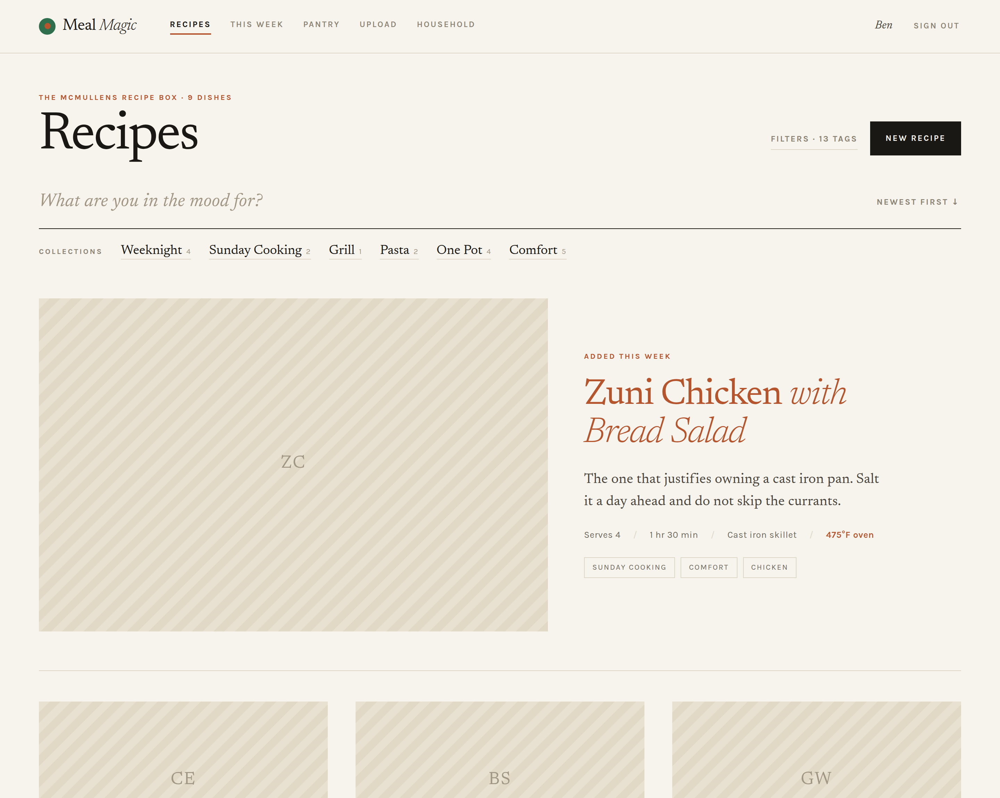
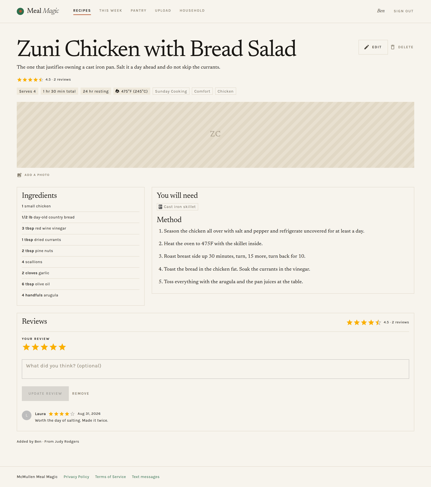
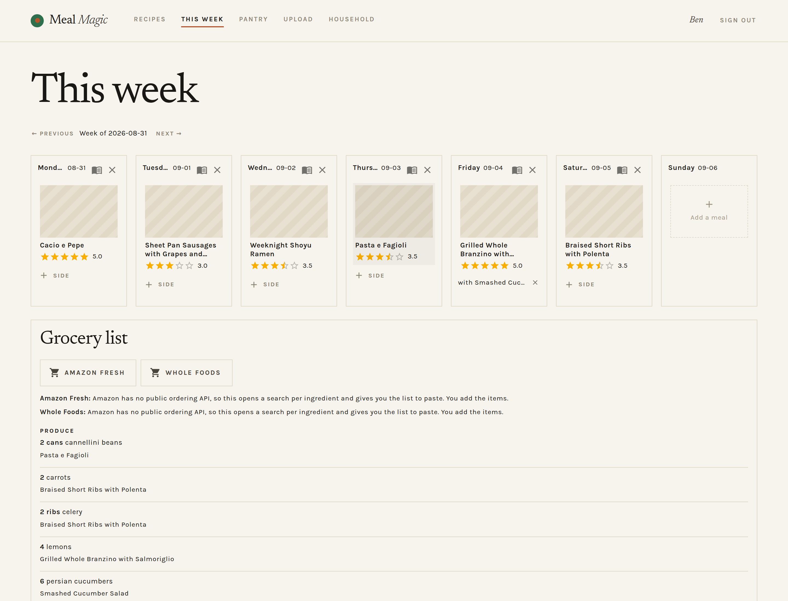
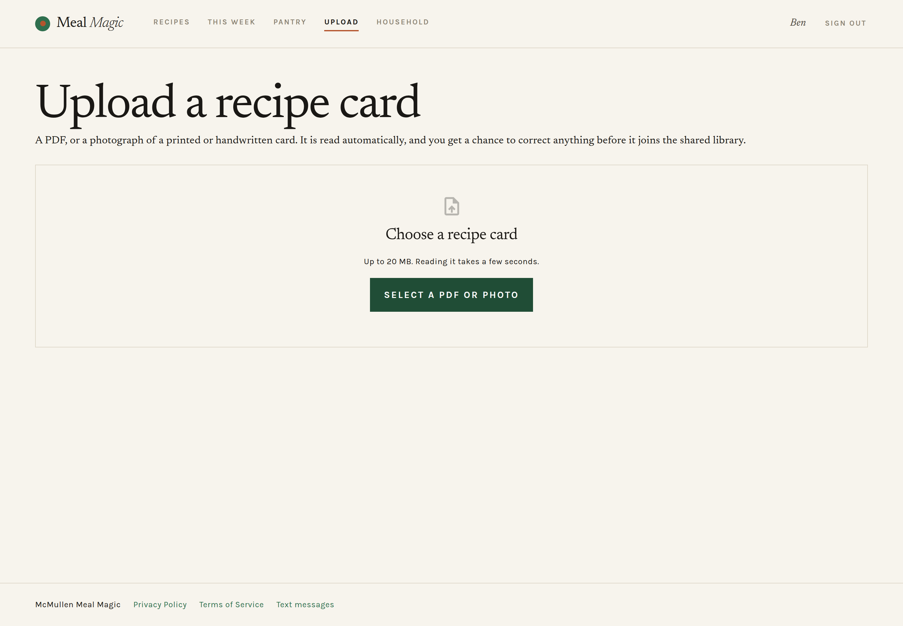

# Meal Magic

Recipe box, weekly meal planner and grocery list for the McMullen household.
Upload a recipe card - a PDF, or a photograph of a printed or handwritten one -
plan a dinner for each night from your library, and take the resulting shopping
list to the shop.

## What it looks like

The library, newest dish given the hero and the rest in a grid. Collections are
a curated way in; everything else lives behind Filters.



A recipe, with everything the card printed: timings, resting, oven temperature,
equipment, and what the household thought of it.



The week, and the list it produces. Ingredients roll up across the meals
planned, grouped by aisle, with the dish each line came from underneath it.



Upload takes a PDF or a photograph of a card.



Screenshots are of a seeded demo library, so no dish photos are attached - the
striped placeholders are what the app draws when a recipe has none.

## What works

- **Invite-only accounts.** Signup requires a code minted by an existing user.
  Every recipe is visible to every signed-in user; the library is shared.
- **Recipe library.** Create, edit and delete recipes with ingredients, method,
  servings, timings, oven temperature, resting time, yield, equipment and tags -
  everything a recipe card prints, so you never have to reopen the original.
- **Search.** Full-text plus substring matching across titles, descriptions,
  method text, ingredients and tags, with tag filters. Search state lives in the
  URL, so a filtered view is linkable.
- **Card upload, PDF or photograph.** Signed-in users upload a recipe card and
  Claude reads it into fields, landing on a review screen before anything is
  saved. A PDF also gives up its dish photo, which is pulled out and attached.
  Photographs are accepted as JPEG, PNG, GIF or WebP - the four formats the
  model itself accepts - so a picture of a card stuck to the fridge, or of a
  page in a book, works as well as an exported file. HEIC, which is what an
  iPhone stores by default, is refused with an explanation rather than a
  failure: share it as a JPEG instead.
- **Reviews.** A star rating and, optionally, what you thought - one review per
  person per recipe, so the average says how many people liked a dish rather
  than how often its keenest fan said so. The average shows on the library
  cards, the planner tiles and the recipe itself.
- **Duplicate detection.** A re-uploaded card - PDF or photograph - is
  recognised by its bytes and refused before the model is called; a
  familiar-looking title warns rather than blocks.
- **Weekly planner.** One dinner a night, picked from tiles showing the dish
  photo, title and its rating.
- **Pantry.** The staples you always have in, managed as a list of their own.
  Nothing in it ever reaches a shopping list, however many recipes call for it.
- **Grocery list.** Ingredients roll up across the week's meals, scaled to the
  servings planned and merged where names and units agree. Pantry staples and
  anything ticked off for the week drop out before the merge.
- **Shopping hand-off.** Send the week's list to Amazon Fresh or Whole Foods (a
  search link per ingredient plus a copyable list). An Instacart provider that
  builds a real cart is written and tested but hidden until a key exists — see
  below.
- **Texting the list.** Everyone in the household who has given a number and
  agreed to be texted gets the week's shopping as an SMS, split into readable
  parts. Written, tested and deployed; not yet carrying traffic, because US
  carriers require a registration that is still in review — see below.

## Stack

| Concern   | Choice                                        |
| --------- | --------------------------------------------- |
| Framework | Next.js 16 (App Router) + React 19            |
| Language  | TypeScript                                    |
| UI        | Material UI 9 (emotion), light + dark         |
| Database  | Postgres via Prisma 7                         |
| Auth      | Better Auth (email + password, invite-gated)  |
| Storage   | Vercel Blob, with a local-disk driver for dev |
| AI        | Claude, for reading recipe cards              |
| Tests     | Vitest, against a real Postgres               |

## Getting started

```bash
npm install            # postinstall runs `prisma generate`
cp .env.example .env   # then fill in the values below
npm run db:migrate     # creates the schema
npm run dev            # http://localhost:3000
```

You need a Postgres instance. Anything works locally; production is Neon.

### Environment

| Variable                | Needed for            | Notes                                              |
| ----------------------- | --------------------- | -------------------------------------------------- |
| `DATABASE_URL`          | everything            | Postgres connection string                         |
| `BETTER_AUTH_SECRET`    | sessions              | `openssl rand -base64 32`                          |
| `BETTER_AUTH_URL`       | sessions              | The app's own origin                               |
| `ANTHROPIC_API_KEY`     | reading a card        | Without it, upload returns a clear 422             |
| `INSTACART_API_KEY`     | sending a cart        | Without it, the planner says so and stays usable   |
| `INSTACART_API_BASE`    | sending a cart        | Dev server by default; switch for production       |
| `BLOB_READ_WRITE_TOKEN` | uploads in production | Unset locally: files go to `public/uploads/`       |
| `TWILIO_ACCOUNT_SID`    | texting the list      | All three are needed; any missing hides the button |
| `TWILIO_AUTH_TOKEN`     | texting the list      | The account's auth token, not an API key secret    |
| `TWILIO_FROM_NUMBER`    | texting the list      | E.164, e.g. `+15085551212`                         |

Missing optional keys degrade gracefully — the rest of the app keeps working
and the affected feature explains what is missing.

### Creating the first account

Signup is invite-only and there is no bootstrap UI yet, so the first user is
made by hand:

```sql
INSERT INTO "user"(id, name, email, "emailVerified", "createdAt", "updatedAt")
VALUES ('bootstrap', 'Your Name', 'you@example.com', true, now(), now());

INSERT INTO invite(id, code, "expiresAt", "createdAt", "createdById")
VALUES ('bootstrap-invite', 'PICKSOMETHINGRANDOM', now() + interval '7 days', now(), 'bootstrap');
```

Then visit `/sign-up?code=PICKSOMETHINGRANDOM`. (Delete the placeholder row
afterwards if you like — the invite survives on its own.)

## Deploying

See [DEPLOYING.md](./DEPLOYING.md) for the full walkthrough — Neon, Vercel Blob,
environment variables, and creating the first account.

Two things that bite if skipped: migrations need Neon's **direct** connection
string (`DIRECT_DATABASE_URL`), not the pooled one, and without a Blob store
uploads land in `./public/uploads`, which serverless hosting wipes on every
deploy.

`GET /api/health` reports whether a deploy reached its database and whether the
schema is present.

## Scripts

| Script               | Does                                         |
| -------------------- | -------------------------------------------- |
| `npm run dev`        | Dev server                                   |
| `npm run build`      | Production build                             |
| `npm test`           | Vitest once (**truncates the dev database**) |
| `npm run lint`       | ESLint                                       |
| `npm run typecheck`  | Route types + `tsc --noEmit`                 |
| `npm run format`     | Prettier                                     |
| `npm run db:migrate` | Create and apply a migration                 |
| `npm run db:deploy`  | Apply migrations (production)                |
| `npm run db:studio`  | Prisma Studio                                |

The integration tests share one database and clean up after themselves, which
means running them against a database you care about will empty it.

## Notes and limitations

**Texting is built but not yet switched on.** The sender, the consent flow and
the shopping-list message all exist, are tested, and are deployed. What is
missing is permission from the carriers.

US carriers will not carry application-sent SMS to ordinary numbers until the
sender is registered under A2P 10DLC: a Brand, then a Campaign describing what
the messages are and how people agreed to receive them. Unregistered traffic is
not bounced, it is silently dropped — the API accepts the message and the
handset never rings, which is the worst failure shape there is. That
registration is in review.

What the app does in the meantime: `smsAvailable()` requires all three Twilio
variables, and the planner hides the button entirely rather than offering one
that cannot work.

The consent side is finished and is what the registration is built on:

- A number is only ever entered by its owner. `saveOwnPhone` writes the
  caller's own row and nothing else — a digit wrong sends the week's shopping
  to a stranger.
- A number is not consent. `smsConsentAt` and `smsConsentSource` are stored
  separately, because being reachable and having agreed are two different
  facts, and a carrier asking to see the opt-in is asking about the second.
- The checkbox is never pre-ticked, and there is no prop that would let it be.
- `/privacy`, `/terms` and `/sms` are public, deliberately outside the login,
  because a policy nobody can read without an account is a policy a reviewer
  will reject. The wording lives in `src/lib/legal.ts` so the box, the pages
  and the campaign submission cannot drift apart.
- A reply of STOP is handled by Twilio, which never tells the application. The
  only notice is a `21610` on the next send, and that clears the person's
  consent while keeping their number — so re-agreeing is a tick rather than
  typing it in again.

**The app cannot tell you a text was delivered.** Twilio answers `201` when it
accepts a message for delivery, which is not the same as a carrier handing it
to a handset, and that response is all the sender sees. So a send that is
filtered downstream is reported as a success. Real delivery state needs a
status-callback webhook, which does not exist yet; until it does, Twilio's
Messaging logs are the only place the truth lives.

**Instacart does not place orders.** Both of its endpoints return a URL to a
prepared page; the customer checks out on Instacart. That is the entire
integration surface — nothing after the hand-off is visible to this app.

**Amazon cannot build a cart at all.** There is no public Amazon Fresh or Whole
Foods ordering API; access is granted case by case through a business
arrangement with Amazon's Fresh team. The add-to-cart URL
(`/gp/aws/cart/add.html?ASIN.1=…`) still works but needs ASINs, which means the
Product Advertising API — an Associates account with qualifying sales, and one
that does not reliably cover Fresh or Whole Foods grocery items. So the Amazon
providers do the honest thing: a search link per ingredient plus the list as
plain text. The UI says so rather than implying a basket was filled.

If you later obtain real Fresh API access, `src/lib/shopping/amazon.ts` is the
only file that needs to change — the provider interface already allows a `cart`
hand-off, and `ShoppingProvider` already distinguishes the two kinds.

**The Amazon storefront search aliases are unverified.** `i=amazonfresh` and
`i=wholefoods` scope a search to those storefronts, but amazon.com is blocked
from the environment this was built in, so the links were never followed. They
are trivially checkable in a browser: the link either lands in the right store
or it does not.

**Instacart cannot be switched on at present.** As of August 2026 Instacart is
not accepting new developer applications and offers no waitlist, which rules out
development and production keys alike — this is not a lead time to plan around,
it is a closed door.

The integration is kept intact rather than deleted, but it says nothing about
itself: no boot warning, no entry in `/api/health`, and no greyed-out button on
the planner. A permanent notice about something nobody can act on is how people
learn to read past notices. The planner offers whatever `listUsableProviders()`
returns, which filters on `available` rather than naming Instacart — so setting
`INSTACART_API_KEY` is the whole of the work if applications reopen.

The integration is kept rather than removed: it is written and tested, and works
the day applications reopen. Until then the Instacart button is disabled and says
why. Amazon Fresh and Whole Foods need no key and no approval, so they are the
shopping path that works today.

**The Instacart request shape is written from documentation, not from a live
call.** No API key was available while building it, and the docs host is
unreachable from the build environment, so the request is covered by tests
against a stubbed transport rather than a real response. Since applications are
closed there is currently no way to verify it against a real response — do that
before trusting it, whenever a key becomes obtainable.

**Pulling the dish photo out of a PDF is JPEG-only.** Images stored as
DCTDecode streams are already complete JPEG files and can be written straight
out. Other encodings hold raw samples that would need colour-space handling and
a PNG encoder. Recipe photos are nearly always JPEG; one that is not simply
arrives without a photo, and can be added by hand.

This applies only to PDFs. An uploaded photograph is the card itself rather
than a container holding a picture, so nothing is extracted from it - the file
is kept as the source card and the recipe starts with no dish photo.

**Unit merging is conservative.** Synonyms fold together (`tablespoons` →
`tbsp`), but nothing converts between units — 1 cup and 200 ml stay as two
lines. A silently wrong conversion is worse than a slightly longer list.

**Restart the dev server after a schema change** — after pulling a branch that
adds a model, too. `npm run dev` and `npm run db:deploy` both regenerate the
Prisma client now, so a restart is all it takes.

Why a restart is needed at all: `src/lib/db.ts` caches the client on
`globalThis` so Next's dev-mode module reloading doesn't open a new connection
pool on every edit, and that cache survives HMR. A running server therefore
keeps the client it started with. The symptom is
`Cannot read properties of undefined (reading 'findMany')` on a model that
plainly exists in the schema, while `npm test` and `npm run typecheck` pass
because they load a fresh client in a new process.

**`npm audit` reports a dev-only advisory** in `deepmerge-ts`, reached through
`@prisma/config` under the Prisma CLI. It is not reachable from application code
at runtime, and the only "fix" available downgrades to Prisma 6. Worth
re-checking when Prisma publishes.
